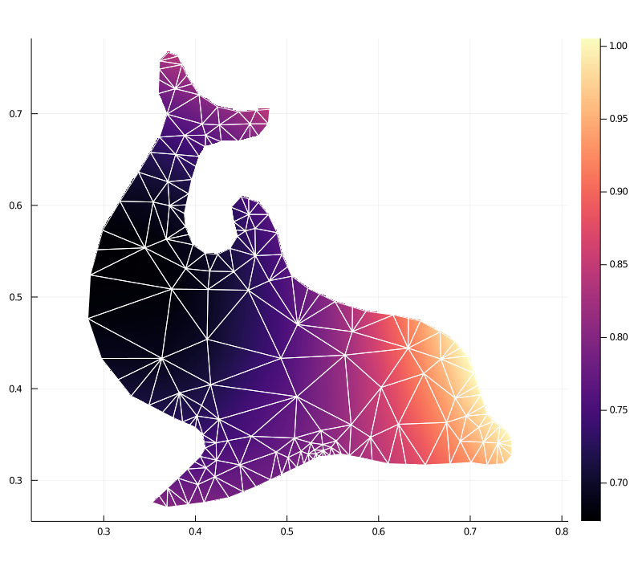

= TriplotRecipes.jl

This package provides recipes for Plots.jl for plotting contour lines and pseudocolor plots on unstructured triangular meshes (`tricontour` and `tripcolor`).
The mesh itself can be shown with `trimesh`.
The contour line computation and pseudocolor rasterization is performed with https://github.com/pazner/TriplotBase.jl[TriplotBase.jl].

Filled contour plots are not currently supported.

== Installation

This package and `TriplotBase.jl` are not registered, and so they can be installed with:

[source,julia]
----
using Pkg
Pkg.add(url="https://github.com/pazner/TriplotBase.jl")
Pkg.add(url="https://github.com/pazner/TriplotRecipes.jl")
----

== Example

Example generated with `examples/dolphin.jl`:

